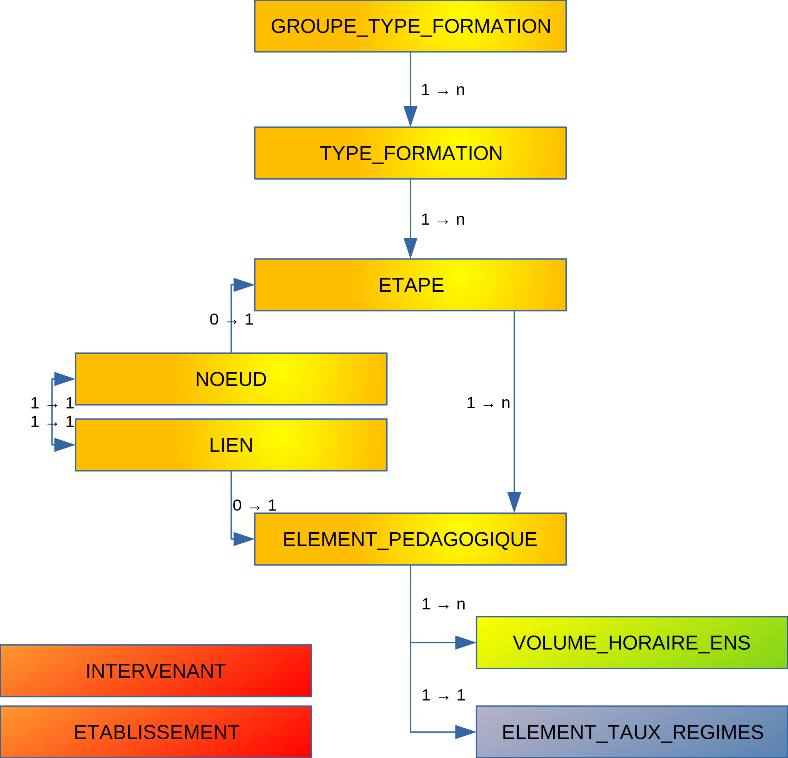
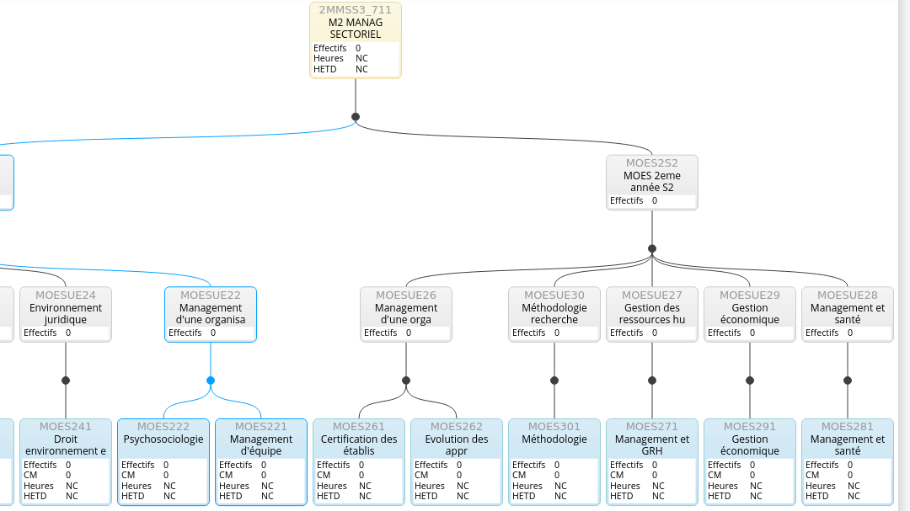

# Connecteur Pégase

## Introduction

Le connecteur Pégase est en cours d'élaboration.
La présente documentation sert à lister les besoins en données liées à l'offre de formation côté OSE.
Elle sera mise à jour au fur et à mesure de l'évolution des développements pour devenir une documentation aidant à la mise en place du futur connecteur.

Le connecteur sera composé de deux parties :

- la première partie sera chargée d'extraire les données de Pégase, selon une tyechnique encore à définir. Puis ces données seront enregistrées dans des tables
  tampon situées sur la base de données OSE.
- la deuxième partie sera contituée des vues sources. Ces dernières vont exploiter les tables tampon pour présenter les données au mécanisme de synchronisation
  de l'application, qui se chargera des modifications effectives en BDD.

NB : cette deuxième partie, côté OSE du connecteur, donc, pourra être mutualisée par la suite avec d'autres connecteurs chargés d'importer des ODF. Ceci
pourrait simplifier leur développement.
La première partie, elle, sera adhérente à Pégase.

Les données sont, elles aussi, à répartir en deux parties :

- il y aura les données liées à l'offre de formation
- et un ensemble de nomenclatures qui pourront avoir d'autres sources qu'OSE, voire être saisies directement dans l'application, sans synchronisation donc.

La présente documentation couvrira à la fois les aspects liés à l'offre de formation et les éventuelles nomenclatures pouvant être alimentées depuis Pégase.
Il reviendra à chaque établissement de synchroniser chaque nomenclature avec Pégase ou bien avec une autre source (référentiel, etc.).

## Architecture de l'offre de formation

Dans OSE, le cœur de l'offre de formation est l'élément pédagogique (EP). Un élément pédagogique représente un enseignement présent au sein d'une ou plusieurs
formations.
C'est sur les EP que reposent les services d'enseignement.

Les éléments pédagogiques sont ensuites regroupés par étapes. Une étape matérialise une année de formation, par exemple, la L1 de Droit ou bien un DU.

Les étapes sont ensuite classées par types de formation, eux-mêmes regroupés en groupes de types de formation.
Dans les groupes de types de formation, nous trouverons Licences, Masters, BUTs, etc.
Ils sont ensuite décomposés en types de formation le cas échéant. Par exemple dans les Masters on a Master et Masters d'enseignement comme types de formation.

Un élément peut être mutualisé entre plusieures étapes, mais il n'a qu'une seule étape principale qu'il est nécessaire d'identifier. Une étape possède un ou
plusieurs éléments.
Le lien entre étapes et éléments se fait via une arborescense de nœuds et de liens sans limites de taile ou de niveau.

Les nœuds sont des éléments intermédiaires. Par exemple un semestre, une option, une UE, etc.
Ils doivent aussi représenter les étapes et les éléments pédagogiques. C'est-à-dire que pour chaque étape, il existe un nœud correspondant, idem pour les
éléments.
Les liens relient les nœuds entre eux. Les nœuds peuvent donc avoir plusieurs parents et plusieurs enfants.

## Charges d'enseignement

OSE a besoin des effectifs pour calculer le coût d'une offre de formation (charges d'enseignement) préalablement à la saisie des services.
Deux tables permettent de collecter les effectifs dans OSE.
Nous avons les effectifs par étape et les effectifs par élément pédagogique.
Ces données doivent être synchronisées également. Tout est ventilé en FI/FA/FC.

Les volumes horaires d'enseignement permettent de récupérer des charges déjà calculées en fonction des groupes et du nombre d'heures prévues dans Pégase.

Deux tables de paramétrages permettent enfin de récupérer des informations telles que les choix minimum/maximum pour les options ou des taux d'assiduité des
étudiants : les scénarios par nœud et par lien.

## Intervenants

Afin de gérer leurs contrats, les étudiants devront être récupérés et synchronisés dans OSE en tant qu'intervenants.

## Données calculées

Restent deux tables à peupler, à l'aide de données calculées sur la base des effectifs.

- Les taux de régimes par élément pédagogique pourront être calculés sur a base des effectifs par éléments pédagogiques
- Les effectifs par nœud par scénario pourront être injectés à partir des effectifs par étape.

Enfin, les chemins pédagogiques. Ces derniers font le lien entre les étapes et les éléments (relation n <=> n). Ils peuvent être calculés en parcourant les
nœuds et n'auront dons pas à être calculés depuis Pégase.

## Schéma de données

## Exemple de diagramme de formation

Dans ce diagramme, l'étape est représentée en jaune.
Les éléments pédagogiques sont en bas, en bleu.

Les nœuds sont représentés de plusieurs manières différentes :
 - les nœuds d'étapes et d'éléments pédagogiques, respectivement représentés par les rectangles jaunes et bleus.
 - les nœuds intermédiaires sous forme de rectangles gris
 - et enfin les nœuds de type liste matérialisés par des points
 
Attention : il existe certaines règles auxquelles il faut bien faire attention :
- les éléments pédagogiques doivent être toujours des feuilles de l'arborescence.
- Il y a systématiquement une alternance entre les nœuds listes et les nœuds normaux. Les listes sont toujours intermédiaires. 

## Détail par tables

### Table PEGASE_GROUPE_TYPE_FORMATION

Les groupes de types de formations sont des nomenclatures permettant de filtrer les formations présentes dans l'application.

|Colonne          |Type    | Longueur | Nullable | Commentaire     |
|-----------------|--------|----------|----------|-----------------|
|Z_SOURCE_ID      |NUMBER  |          | Non      | ==> SOURCE.CODE |
|SOURCE_CODE      |VARCHAR2| 100      | Non      |                 |
|LIBELLE_COURT    |VARCHAR2| 20       | Non      |                 |
|LIBELLE_LONG     |VARCHAR2| 50       | Non      |                 |
|ORDRE            |NUMBER  |          | Non      |                 |
|PERTINENCE_NIVEAU|NUMBER  | 1        | Non      | 1 ou 0 (bool)   |

Contrainte d'unicité : [SOURCE_CODE]

`ORDRE` est utilisée pour le tri.

`PERTINENCE_NIVEAU` sert à préciser si les étapes qui en dépendant delèvent de formations pluriannuelles (License, Master), ou bien si le niveau n'a pas de
sens (DU, etc.)

Exemples de groupes de types de formations : License, Master, Doctorat, DU.

### Table PEGASE_TYPE_FORMATION

Idem, mais à un niveau plus fin.

|Colonne           | Type     | Longueur | Nullable | Commentaire                           |
|------------------|----------|----------|----------|---------------------------------------|
|Z_SOURCE_ID       | NUMBER   |          | Non      | ==> SOURCE.CODE                       |
|SOURCE_CODE       | VARCHAR2 | 100      | Non      |                                       |
|Z_GROUPE_ID       | NUMBER   |          | Oui      | ==> GROUPE_TYPE_FORMATION.SOURCE_CODE |
|LIBELLE_COURT     | VARCHAR2 | 15       | Non      |                                       |
|LIBELLE_LONG      | VARCHAR2 | 80       | Non      |                                       |
|SERVICE_STATUTAIRE| NUMBER   | 1        | Non      | 1 ou 0 (bool)                         |

Contrainte d'unicité : [SOURCE_CODE]

`SERVICE_STATUTAIRE` sert à déterminer si les heures de service adossées à ces formations peuvent être comptées dans le service statutaire des enseignants ou
bien si ces heures ne doivent compter que si elles sont classées comme heures complémntaires.

### Table PEGASE_ETAPE

Les étapes matérialisent des années de formations. Exemple : la L1 de Chimie est une étape.

| Colonne                  | Type     | Longueur | Nullable | Commentaire                         |
|--------------------------|----------|----------|----------|-------------------------------------|
| Z_SOURCE_ID              | NUMBER   |          | Non      | ==> SOURCE.CODE                     |
| SOURCE_CODE              | VARCHAR2 | 100      | Non      |                                     |
| ANNEE_ID                 | NUMBER   |          | Non      | ==> ANNEE.ID                        |
| CODE                     | VARCHAR2 | 50       | Non      |                                     |
| LIBELLE                  | VARCHAR2 | 200      | Non      |                                     |
| Z_TYPE_FORMATION_ID      | NUMBER   |          | Non      | ==> TYPE_FORMATION.SOURCE_CODE      |
| Z_STRUCTURE_ID           | NUMBER   |          | Non      | ==> STRUCTURE.SOURCE_CODE           |
| Z_DOMAINE_FONCTIONNEL_ID | NUMBER   |          | Non      | ==> DOMAINE_FONCTIONNEL.SOURCE_CODE |
| NIVEAU                   | NUMBER   |          | Oui      |                                     |
| SPECIFIQUE_ECHANGES      | NUMBER   | 1        | Non      | 1 ou 0 (bool)                       |
| EFFECTIF_FI              | NUMBER   |          | Oui      |                                     |
| EFFECTIF_FA              | NUMBER   |          | Oui      |                                     |
| EFFECTIF_FC              | NUMBER   |          | Oui      |                                     |

Contrainte d'unicité : [SOURCE_CODE,ANNEE_ID]

`Z_STRUCTURE_ID` structure (généralement une composante) chargés de gérer l'étape et tout ce qui lui est associé
`NIVEAU` devra être renseigné si l'étape relève d'un groupe de type de formation avec `PERTINENCE_NIVEAU` à 1.
`SPECIFIQUE_ECHANGES` à 1 si l'étape est liés aux échanges d'étudiants internationaux (Erasmus)
`EFFECTIF_%` Nombre d'étudiants inscrits, ventilés en FI, FA et FC. NULL si l'information n'est pas connue

### Table PEGASE_ELEMENT_PEDAGOGIQUE

Les éléments pédagogiques sont des enseignements composant une ou plusieurs formations.

| Colonne         | Type     | Longueur | Nullable | Commentaire                 |
|-----------------|----------|----------|----------|-----------------------------|
| Z_SOURCE_ID     | NUMBER   |          | Non      | ==> SOURCE.CODE             |
| SOURCE_CODE     | VARCHAR2 | 100      | Non      |                             |
| ANNEE_ID        | NUMBER   |          | Non      | ==> ANNEE.ID                |
| CODE            | VARCHAR2 | 50       | Non      |                             |
| LIBELLE         | VARCHAR2 | 200      | Non      |                             |
| Z_ETAPE_ID      | NUMBER   |          | Non      | ==> ETAPE.SOURCE_CODE       |
| Z_STRUCTURE_ID  | NUMBER   |          | Non      | ==> STRUCTURE.SOURCE_CODE   |
| Z_PERIODE_ID    | NUMBER   |          | Oui      | ==> PERIODE.CODE            |
| Z_DISCIPLINE_ID | NUMBER   |          | Oui      | ==> DISCIPLINE.SOURCE_CODE  |
| TAUX_FOAD       | FLOAT    |          | Non      | 1 par défaut                |
| FI              | NUMBER   | 1        | Non      | 1 ou 0 (bool), 1 par défaut |
| FA              | NUMBER   | 1        | Non      | 1 ou 0 (bool), 1 par défaut |
| FC              | NUMBER   | 1        | Non      | 1 ou 0 (bool), 1 par défaut |
| TAUX_FI         | FLOAT    |          | Non      | 1 par défaut                |
| TAUX_FA         | FLOAT    |          | Non      | 0 par défaut                |
| TAUX_FC         | FLOAT    |          | Non      | 0 par défaut                |
| EFFECTIF_FI     | NUMBER   |          | Oui      |                             |
| EFFECTIF_FA     | NUMBER   |          | Oui      |                             |
| EFFECTIF_FC     | NUMBER   |          | Oui      |                             |

Contraintes d'unicité : [SOURCE_CODE,ANNEE_ID]

`Z_ETAPE_ID` renvoie vers l'étape principale de l'élément. Ce dernier pourra être lié à d'autres étapes via les nœuds/liens.
`Z_STRUCTURE_ID` structure (généralement une composante) chargés de gérer l'élément et tout ce qui lui est associé
`Z_PERIODE_ID` renvoie vers une période d'enseignement (semestre 1 ou 2, ou NULL). Si NULL, alors l'élément est considéré comme courant sur toute l'année
universitaire.
`TAUX_FOAD` pourcentage d'enseignement à distance dans l'élément. Valeur comprise entre 0 et 1.
`FI`, `FA`, `FC` flags pour déterminer si l'élément est ouvert à la FI, à la FA ou à la FC
`TAUX_F%` Pourcentages de FI, FA et FC dans l'esneignement. Chaque valeur doit être comprise entre 0 et 1. La somme des trois doit obligatoirement être égale à
1.
`EFFECTIF_F%` Nombre d'étudiants inscrits dans l'élément, ventilés en FI, FA, FC.

### Table PEGASE_VOLUME_HORAIRE_ENS

Les volumes horaires d'enseignement permettent de récupérer, par élément et par type d'intervention (CM, TD, TP, etc.), la charge d'enseignement sur laquelle
adosser les services.

| Colonne                  | Type     | Longueur | Nullable | Commentaire                         |
|--------------------------|----------|----------|----------|-------------------------------------|
| Z_SOURCE_ID              | NUMBER   |          | Non      | ==> SOURCE.CODE                     |
| SOURCE_CODE              | VARCHAR2 | 100      | Non      |                                     |
| ANNEE_ID                 | NUMBER   |          | Non      | ==> ANNEE.ID                        |
| Z_ELEMENT_PEDAGOGIQUE_ID | NUMBER   |          | Non      | ==> ELEMENT_PEDAGOGIQUE.SOURCE_CODE |
| Z_TYPE_INTERVENTION_ID   | NUMBER   |          | Non      | ==> TYPE_INTERVENTION.CODE          |
| HEURES                   | FLOAT    |          | Non      |                                     |
| GROUPES                  | FLOAT    |          | Oui      |                                     |

Contraintes d'unicité : [SOURCE_CODE,ANNEE_ID], [ANNEE_ID, Z_ELEMENT_PEDAGOGIQUE_ID, Z_TYPE_INTERVENTION_ID]

### Table PEGASE_NOEUD

Les nœuds sont, dans une arborescence de formation les objets intermédiaires entre les étapes et les éléments.
Les étapes et les éléments doivent également avoir leurs propres nœuds.

| Colonne                  | Type     | Longueur | Nullable | Commentaire                         |
|--------------------------|----------|----------|----------|-------------------------------------|
| Z_SOURCE_ID              | NUMBER   |          | Non      | ==> SOURCE.CODE                     |
| SOURCE_CODE              | VARCHAR2 | 100      | Non      |                                     |
| ANNEE_ID                 | NUMBER   |          | Non      | ==> ANNEE.ID                        |
| CODE                     | VARCHAR2 | 50       | Non      |                                     |
| LIBELLE                  | VARCHAR2 | 255      | Non      |                                     |
| LISTE                    | NUMBER   | 1        | Non      | 1 ou 0 (bool), 0 par défaut         |
| Z_ETAPE_ID               | NUMBER   |          | Oui      | ==> ETAPE.SOURCE_CODE               |
| Z_ELEMENT_PEDAGOGIQUE_ID | NUMBER   |          | Oui      | ==> ELEMENT_PEDAGOGIQUE.SOURCE_CODE |
| Z_STRUCTURE_ID           | NUMBER   |          | Oui      | ==> STRUCTURE.SOURCE_CODE           |
| ASSIDUITE                | FLOAT    |          | Non      | 1 par défaut                        |

Contrainte d'unicité : [SOURCE_CODE,ANNEE_ID]

`LISTE` Noeud spécifique, de type "liste".
`Z_ETAPE_ID` renvoie vers une étape si le nœud correspond à une étape.
`Z_ELEMENT_PEDAGOGIQUE_ID` renvoie vers un élément pédagogique si le nœud y correspond.
`ASSIDUITE` Taux compris entre 0 et 1. Si 1, on s'attend à ce que tous les étudiants participent au cours.

### Table PEGASE_LIEN

Les liens relient les nœuds.

| Colonne             | Type     | Longueur | Nullable | Commentaire                 |
|---------------------|----------|----------|----------|-----------------------------|
| Z_SOURCE_ID         | NUMBER   |          | Non      | ==> SOURCE.CODE             |
| SOURCE_CODE         | VARCHAR2 | 100      | Non      |                             |
| ANNEE_ID            | NUMBER   |          | Non      | ==> ANNEE.ID                |
| Z_NOEUD_SUP_ID      | NUMBER   |          | Non      | ==> NOEUD.SOURCE_CODE       |
| Z_NOEUD_INF_ID      | NUMBER   |          | Non      | ==> NOEUD.SOURCE_CODE       |
| Z_STRUCTURE_ID      | NUMBER   |          | Oui      | ==> STRUCTURE.SOURCE_CODE   |
| ACTIF               | NUMBER   | 1        | Non      | 1 ou 0 (bool), 1 par défaut |
| POIDS               | FLOAT    |          | Non      | 1 par défaut                |
| CHOIX_MINIMUM       | NUMBER   |          | Oui      |                             |
| CHOIX_MAXIMUM       | NUMBER   |          | Oui      |                             |

Contrainte d'unicité : [SOURCE_CODE,ANNEE_ID], [ANNEE_ID,Z_NOEUD_SUP_ID,Z_NOEUD_INF_ID]

`ACTIF` Le lien peut être actif ou non.
`POIDS` Utile uniquement en cas de choix, afin de préciser d'éventuelles préférences (par exemple entre plusieurs cours de langues étrangères au choix,
l'anglais sera statistiquement préféré...)
`CHOIX_MINIMUM` et `CHOIX_MAXIMUM` Choix entre les nœuds sous-jacents, entre 1 et 1 => un devra être choisi. NULL = tous. Donc min=NULL et max=NULL => aucun
choix : tout le monde devra tout suivre.

## Nomenclatures et autres données

Certaines nomenclatures, par nécessairement liées à l'offre de formation, pourront être récupérées de Pégase.
D'autres ne sont pas synchronisables et ne sont présentes que dans OSE.

### INTERVENANT

Depuis Pégase, il peut être nécessaire de récupérer la liste des étudiants, en particulier si vous souhaitez établir des contrats étudiants.
Ces étudiants seront traités dans OSE comme étant des intervenants ayant un statut spécifique (étudiant, donc).
Les données nécessaires sont les suivantes :

| Colonne                    | Type     | Longueur | Nullable | Commentaire                                                                 |
|----------------------------|----------|----------|----------|-----------------------------------------------------------------------------|
| Z_SOURCE_ID                | VARCHAR2 | 15       | Non      | ==> SOURCE.CODE                                                             |
| SOURCE_CODE                | VARCHAR2 | 100      | Oui      |                                                                             |
| CODE                       | VARCHAR2 | 60       | Non      | Identifiant unique de l'individu dans le système d'information              |
| CODE_RH                    | VARCHAR2 | 60       | Oui      | Numéro d'étudiant (utile pour faciliter les recherches et l'identification) |
| UTILISATEUR_CODE           | VARCHAR2 | 60       | Oui      | Identifiant pour faire lien avec le LDAP                                    |
| Z_STRUCTURE_ID             | VARCHAR2 | 100      | Oui      | ==> STRUCTURE.SOURCE_CODE                                                   |
| Z_STATUT_ID                | VARCHAR2 | 100      | Non      | ==> STATUT.CODE               (code du statut étudiant à fournir)           |
| Z_CIVILITE_ID              | VARCHAR2 | 100      | Oui      | ==> CIVILITE.LIBELLE_COURT                                                  |
| NOM_USUEL                  | VARCHAR2 | 60       | Non      |                                                                             |
| PRENOM                     | VARCHAR2 | 60       | Non      |                                                                             |
| DATE_NAISSANCE             | DATE     |          | Non      |                                                                             |
| NOM_PATRONYMIQUE           | VARCHAR2 | 60       | Oui      |                                                                             |
| COMMUNE_NAISSANCE          | VARCHAR2 | 60       | Oui      |                                                                             |
| Z_PAYS_NAISSANCE_ID        | VARCHAR2 | 100      | Oui      | ==> PAYS.SOURCE_CODE                                                        |
| Z_DEPARTEMENT_NAISSANCE_ID | VARCHAR2 | 100      | Oui      | ==> DEPARTEMENT.SOURCE_CODE                                                 |
| Z_PAYS_NATIONALITE_ID      | VARCHAR2 | 100      | Oui      | ==> PAYS.SOURCE_CODE                                                        |
| TEL_PRO                    | VARCHAR2 | 30       | Oui      |                                                                             |
| TEL_PERSO                  | VARCHAR2 | 30       | Oui      |                                                                             |
| EMAIL_PRO                  | VARCHAR2 | 255      | Oui      |                                                                             |
| EMAIL_PERSO                | VARCHAR2 | 255      | Oui      |                                                                             |
| ADRESSE_PRECISIONS         | VARCHAR2 | 240      | Oui      |                                                                             |
| ADRESSE_NUMERO             | VARCHAR2 | 4        | Oui      |                                                                             |
| Z_ADRESSE_NUMERO_COMPL_ID  | VARCHAR2 | 100      | Oui      | ==> ADRESSE_NUMERO_COMPL.CODE                                               |
| Z_ADRESSE_VOIRIE_ID        | VARCHAR2 | 100      | Oui      | ==> ADRESSE_VOIRIE.SOURCE_CODE                                              |
| ADRESSE_VOIE               | VARCHAR2 | 60       | Oui      |                                                                             |
| ADRESSE_LIEU_DIT           | VARCHAR2 | 60       | Oui      |                                                                             |
| ADRESSE_CODE_POSTAL        | VARCHAR2 | 15       | Oui      |                                                                             |
| ADRESSE_COMMUNE            | VARCHAR2 | 50       | Oui      |                                                                             |
| Z_ADRESSE_PAYS_ID          | VARCHAR2 | 100      | Oui      | ==> PAYS.SOURCE_CODE                                                        |
| NUMERO_INSEE               | VARCHAR2 | 20       | Oui      |                                                                             |
| NUMERO_INSEE_PROVISOIRE    | NUMBER   |          | Non      | Flag (1 ou 0)                                                               |
| IBAN                       | VARCHAR2 | 50       | Oui      |                                                                             |
| BIC                        | VARCHAR2 | 20       | Oui      |                                                                             |
| RIB_HORS_SEPA              | NUMBER   |          | Non      | Flag (1 ou 0)                                                               |
| AUTRE_1                    | VARCHAR2 | 1000     | Oui      |                                                                             |
| AUTRE_2                    | VARCHAR2 | 1000     | Oui      |                                                                             |
| AUTRE_3                    | VARCHAR2 | 1000     | Oui      |                                                                             |
| AUTRE_4                    | VARCHAR2 | 1000     | Oui      |                                                                             |
| AUTRE_5                    | VARCHAR2 | 1000     | Oui      |                                                                             |
| VALIDITE_DEBUT             | DATE     |          | Oui      | Date de début de validité (NULL = depuis toujours)                          |
| VALIDITE_FIN               | DATE     |          | Oui      | Date de fin   de validité (NULL = pas d'expiration)                         |

### ETABLISSEMENT

Liste des établissements utilisables dans OSE

| Colonne       | Type      | Longueur | Nullable | Commentaire     |
|---------------|-----------|----------|----------|-----------------|
| Z_SOURCE_ID   | NUMBER    |          | Non      | ==> SOURCE.CODE |
| SOURCE_CODE   | VARCHAR2  | 100      | Non      |                 |
| LIBELLE       | VARCHAR2  | 100      | Non      |                 |
| LOCALISATION  | VARCHAR2  | 60       | Oui      |                 |
| DEPARTEMENT   | VARCHAR2  | 3        | Oui      |                 |

Contrainte d'unicité : [SOURCE_CODE]

`LOCALISATION` Libellé de la ville
`DEPARTEMENT` Numéro du département

### Structures (table STRUCTURE)

Les structures sont des unités de gestion. Le plus souvent, elles correspondent à des composantes (UFR, Ecole, etc.).
Il se peut que dans certains établissements de plus petite taille comme des écoles d'ingénieur, les structures représentent les départements.

### Domaines fonctionnels (table DOMAINE_FONCTIONNEL)

Les domaines fonctionnels sont une nomenclature utile pour la comtabilité analytique.
Certains d'entre eux sont communs à tous les établissements d'enseignement supérieur.

Exemples : 
- Form init. licence (D101) 
- Form init. master (D102)
- Form init. doct (D103)
- Santé, culture, sport étu (D203) 
- ...

### Périodes (table PERIODE)

Les périodes utiles pour l'enseignement sont le premier et le second semestre (S1 et S2 en codes OSE). 

### Disciplines (table DISCIPLINE)

Les disciplines sont une nomenclature fusionnant les sections CNU et les disciplines du second degré.

### types d'intervention (table TYPE_INTERVENTION)

Exemple de types d'intervention : CM, TD, TP.
D'autres types d'intervention peuvent être ajoutés à OSE. 
Ils ne sont pas synchronisables. Attention alors à bien être coordonné avec Pégase, afin que les charges d'enseignement remontent bien.

## Mise en œuvre

A faire.
S'inspirer du connecteur Actul pour la DDL et le système d'installation/synchronisation.