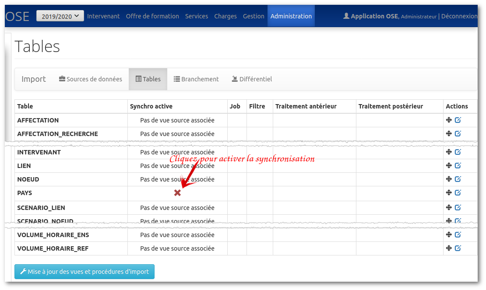
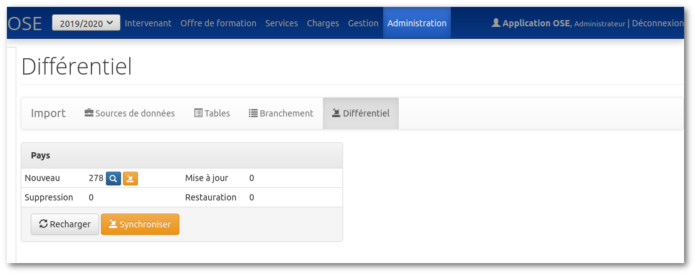

# Activer et synchroniser une table

## Activer une table

Par défaut, les tables sont désactivées. Vous devrez activer la synchronisation pour que celle-ci puisse se faire.

Allez dans OSE, menu Administration / Synchronisation, Page Tables.



Le bouton "Mise à jour des vues et procédures d'import" vous permet de recréer les vues différentielles et les procédures de mise à jour.
Utile si vous avez à modifier vos vues sources.
Cette opération est faite implicitement si vous activez/désactivez la synchronisation pour une table.

La commande `./bin/ose build-synchronisation` met à jour de la même manière vos vues et procédures d'import.

## Synchroniser une table

### Dans l'application

Allez dans OSE, menu Administration / Synchronisation, Page Différentiel.

Vous verrez ici toutes les tables dont la synchronisation a été activée.



Vous pouvez :
- Constater le différentiel s'il y en a un. Dans l'exemple ci-dessus, tous lesp ays sont à importer.
- Réaliser les opérations une par une (petits boutons à droite de nouveau, mise à jour, etc.).
- Ou bien tout synchroniser d'un coup (bouton Synchroniser).

En cas d'erreur, l'application vous affichera les enregistrements qui ont posé problème.

### Directement en base de données

#### Afficher le différentiel

Il existe une vue différentielle par table synchronisée.
Ces vues sont nommées V_DIFF_*nom-de-la-table*

Par exemple, 
```sql
SELECT * FROM V_DIFF_PAYS
```
va vous afficher le différentiel existant entre la vue source et la table PAYS.
Attention : ce différentiel ne prend en compte que les données synchronisables. Si vous ajoutez un pays à la main dans la base de données avec OSE comme source, celui-ci n'apparaitra pas dans cette vue.

Dans cette vue, vous retrouverez les colonnes suivantes :
- ID qui vous renseigne sur l'ID dans la table destination si l'enregistrement existe déjà.
- IMPORT_ACTION qui vous donne l'action à effectuer (insert, update, delete, undelete).
- La liste des colonnes synchronisables de la table avec comme valeurs celles de la vue.
- La même liste des colonnes synchronisables de la table avec "U_" comme préfixe (par exemple U_CODE pour la colonne CODE) et en valeur 1 s'il y a une différence entre la vue source et la table et 0 si la donnée ne change pas.

#### Opérations de synchronisation

Pour effectuer toutes les opérations de synchronisation :
```sql
BEGIN
  unicaen_import.synchronisation('PAYS');
END;
```

Pour n'effectuer que les insertions de nouvelles données :
```sql
BEGIN
  unicaen_import.synchronisation('PAYS', 'WHERE import_action=''insert''');
END;
```

Pour ne synchroniser qu'un sous-ensemble de données (ici uniquement le pays FRANCE dont le code est 100)
```sql
BEGIN
  unicaen_import.synchronisation('PAYS', 'WHERE code=''100''');
END;
```

#### Log

En cas de soucis, vous avez à votre disposition la table SYNC_LOG recense toutes les erreurs qui ont pu se produire lors d'une synchronisation.

```sql
SELECT * FROM SYNC_LOG
```

N'hésitez pas à purger ce log de temps en temps :

```sql
TRUNCATE TABLE SYNC_LOG
```
