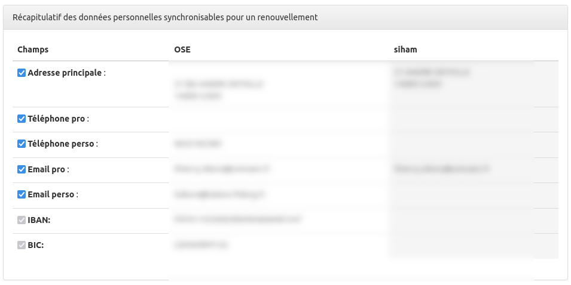

**ATTENTION** : cette docmuentation est valable à partir de la version 17 de OSE. Pour les versions antérieures le module exportRh n'est pas disponible.

# Principe

Le module ExportRh de OSE permet de rendre une disponible au sein de l'applicatif une fonctionnalité d'export des données intervenants dans le SI RH. Pour le moment, seul SIHAM est pris en charge par ce module.

Si vous activez le module export et que vous avez SIHAM, vous pourrez pour un intervenant, vacataire et uniquement pour l'année universitaire en cours, lancer une prise en charge ou un renouvellement directement dans SIHAM à partir de OSE.

A noter que le renouvellement, ou la prise en charge SIHAM n'est possible que si le contrat OSE a une date de retour signée.

# Connecteur SIHAM

## Configuration

Pour utiliser le module ExportRh Siham vous devez ajouter dans le fichier de configuration config.local.php les lignes suivantes :

```php
   'export-rh' => [
        //définition du connecteur SI RH à utiliser pour le module export RH de OSE
        'actif'      => true,//False pour désactiver l'export RH
        'connecteur' => 'siham',//Le nom du connecteur dont vous avez besoin, pour le moment seul le connecteur SIHAM a été développé.
    ],
```

L'utilisation du connecteur SIHAM du module ExportRh nécessite aussi l'ajout d'un fichier de configration spécifique à SIHAM dans le dossier à la racine /config/autoload/unicaen-siham.gloabl.php

```php
<?php

return [
    'unicaen-siham' => [

        // Options concernant l'appel du web service .
        'api' => [
            'base_url' => 'https://siham.xxxxx.fr/',//L'url permettant d'accéder aux webservices SIHAM
            'wsdl'     => [//Définition des webservices utilisables
                'DossierAgentWebService'       => 'DossierAgentWebService/DossierAgentWebService?wsdl',
                'RechercheAgentWebService'     => 'RechercheAgentWebService/RechercheAgentWebService?wsdl',
                'ListeAgentsWebService'        => 'ListeAgentsWebService/ListeAgentsWebService?wsdl',
                'DossierParametrageWebService' => 'DossierParametrageWebService/DossierParametrageWebService?wsdl',
                'PECWebService'                => 'PECWebService/PECWebService?wsdl',


            ],
        ],

        'debug'       => [
            /*Active le debug des interactions avec les webservices SIHAM*/
            'activate'      => true,
            /*Debug uniquement si une exception est levée*/
            'onlyException' => false,
            /* IP ou nom DNS du serveur SMTP */
            'smtpHost'      => 'xxxxxxxxxxx',
            /* Port du serveur SMTP (généralement, 25) */
            'smtpPort'      => 25,
            /* Adresse de l'expéditeur par défaut */
            'from'          => 'xxxxx@xxxx.xx',
            /* Adresse du destinataire*/
            'to'            => 'xxxxx@xxxx.xx',
        ],
        // Options du client SOAP utilisé pour appeler le web service.
        'soap_client' => [
            'params' => [
                //Crédentials pour accéder aux webservices SIHAM
                'login'      => 'xxxxx',
                'password'   => 'xxxxx',
                'version'    => SOAP_1_1,
                'cache_wsdl' => 0,
                'trace'      => 1,
                //'proxy_host' => 'host.domain.fr',
                //'proxy_port' => 3128,
            ],

        ],

        'code-nomenclature' => [
            //Code répertoire des différentes nommenclatures SIHAM utilsées
            'grades'                     => 'HJB',
            'corps'                      => 'HJV',
            'section-cnu'                => 'VSP',
            'specialites'                => 'HIS',
            'familles-proffessionnelles' => 'VFP',
            'qualites-statutaires'       => 'HJK',
            'categories'                 => 'HKE',
            'type-contrats'              => 'UIP',
            'statuts'                    => 'HJ8',
            'modalites'                  => 'UHU',
            'positions'                  => 'HKK',
            'echelons'                   => 'HKM',
            'administration'             => 'UAA',
            'etablissements'             => 'DRE',
            'mode-paiement'              => 'DRN',
            'pays'                       => 'UIN',

        ],

        'code-administration' => 'UCN',
        'code-etablissement'  => '0141408E',
        
        //Permet de filtrer les valeurs affichées dans le formulaire de prise en charge SIHAM par code répertoire
        'filters'            => [
            'HKK'     => [
                'ACI01' => 'ACI01 - Affecté dans l\'administration',
            ],
            'emplois' => [
                'UCNVCE' => 'UCNVCE - Vacataire chargé d\'enseignement',
                'UCNVA'  => 'UCNVA - Vacataire administratif',
            ],
            'UHU'     => [
                'MS100' => 'MS100 - Temps plein',
            ],
            'HJ8'     => [
                'C2038' => 'C2038 - Chargé d\'enseignement',
                'C2041' => 'C2041 - Agent temporaire vacataire',
                'C2052' => 'C2052 - Chargé d\'enseignement vacataire fonctionnaire',
                'C1201' => 'C1201 - Intermittent spectacle',
                'C1204' => 'C1204 - Autre personnel payé acte / tâche',
                'C1210' => 'C1210 - Praticien agréé - Maître de stage',
            ],
        ],
        
        //Permet d'excluse les statuts pour lesquels on ne souhaite pas faire de PEC ou REN
        'exclude-statut-ose' => [
            'BIATSS'             => 'BIATSS',
            'SS_EMPLOI_NON_ETUD' => 'Sans emploi, non étudiant',
            'IMP'                => 'Vacataire académique sur convention',

        ],

    ],
];
```

## Privilège et accès à l'export

Pour accéder aux écrans d'export RH, il faut vous rendre au niveau de la fiche de l'intervenant, si vous avez le privilège associé, vous verrez un nouvel onglet Export RH :


Voici le nouveau privilège à donner aux rôles :


## Prise en charge d'un intervenant (PEC)

On appelle prise en charge (PEC), le fait d'exporter vers SIHAM un intervenant inconnu du SI RH. Un matricule va être créé et attribué à cet intervenant.

Pour une PEC, les données personnelles sont injectées dans SIHAM pour la première fois, on parle bien des données issues du dossier de l'intervenant et non pas celles de la fiche intervenant :


Lors d'une prise en charge, OSE va créer un nouvelle affectation pour l'année universitaire en cours, et créer le statut, le type d'emploi, la position administrative et le service dans SIHAM, le tout en auto validé dans SIHAM.

Toutes ces informations sont paramétrables à l'aide du formulaire personnalisé SIHAM :


## Renouvellement d'un intervenant (REN)

On appelle renouvellement (REN), le fait d'exporter vers SIHAM un intervenant déjà connu du SI RH.

Le renouvellement va d'abord mettre à jour certaines données personnelles de l'intervenant, à noter que vous pourrez désactiver la synchronisation de certaines données en décochant les lignes :



**Attention, les WS SIHAM de l'AMUE sont buggés pour la mise à jour des coordonnées bancaires lors d'un renouvellement, il faudra donc les mettre à jour manuellement si nécessaire. Une demande d'assistance est en cours (mettre le lien ici)**

De la même façon, OSE va créer un nouvelle affectation pour l'année universitaire en cours, et mettre à jour le statut, le type d'emploi, la position administrative et le service dans SIHAM, le tout en auto validé dans SIHAM.


## Suite à la PEC ou au REN

Une fois la prise en charge ou le renouvellement effectué via OSE, vous retrouverez le dossier de l'agent à jour, il ne vous restera plus qu'à le contractualiser manuellement dans SIHAM.


## Synchronisation

Si l'intervenant possède déjà une affectation sur l'année en cours, vous ne pourrez donc pas lancer une PEC ou un REN, mais vous aurez quand même la possiblité de synchroniser les quelques données personnelles de OSE vers SIHAM.

**Attention, les WS SIHAM de l'AMUE sont buggés pour la mise à jour des coordonnées bancaires lors d'une synchronisation, il faudra donc les mettre à jour manuellement si nécessaire. Une demande d'assistance est en cours (mettre le lien ici)**

## Indicateur

Un nouvel indicateur situé dans la rubrique contrat des indicateurs (indicateur N°380), vous donne la liste des vacataires à prendre en charge ou à renouveller.

Il n'est utilisable que sur l'année universitaire en cours, car comme dit précédement, seul les vacataires de l'année universitaire en cours sont concernés par le module ExporRh.


