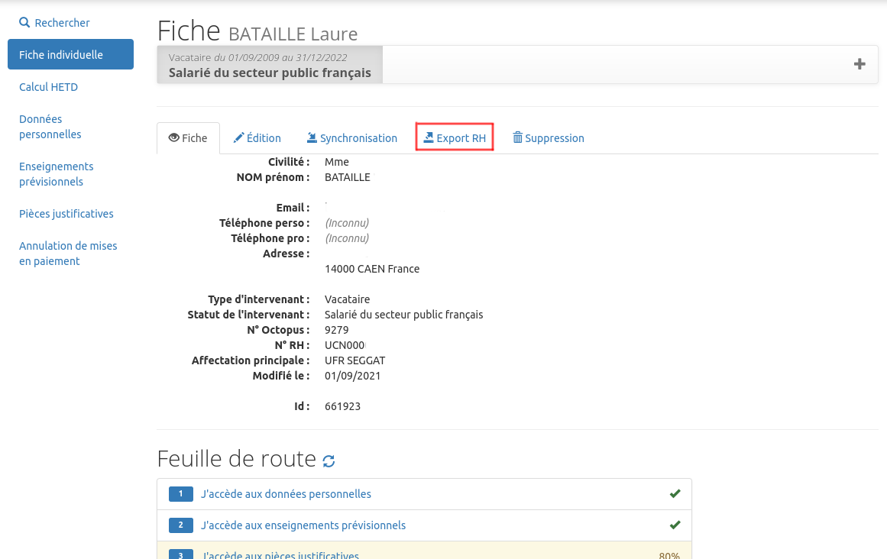
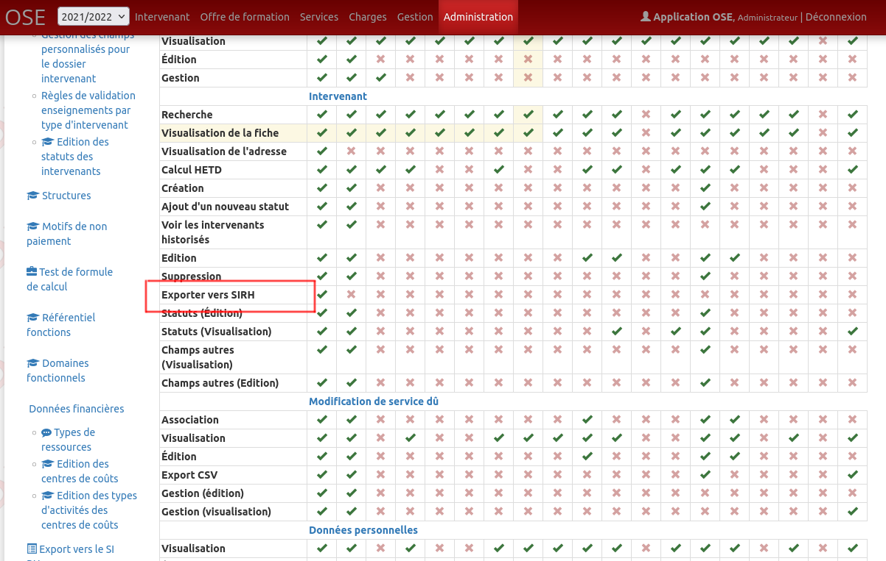

**ATTENTION** : cette docmuentation est valable à partir de la version 17 de OSE. Pour les versions antérieures le module exportRh n'est pas disponible.

# Principe

Le module ExportRh de OSE permet de rendre une disponible au sein de l'applicatif une fonctionnalité d'export des données intervenants dans le SI RH. Pour le
moment, seul SIHAM est pris en charge par ce module.

Si vous activez le module export et que vous avez SIHAM, vous pourrez pour un intervenant, vacataire et uniquement pour l'année universitaire en cours, lancer
une prise en charge ou un renouvellement directement dans SIHAM à partir de OSE.

A noter que le renouvellement, ou la prise en charge SIHAM n'est possible que si le contrat OSE a une date de retour signée.

# Fonctionnement du connecteur SIHAM

## Privilège et accès à l'export

Pour accéder aux écrans d'export RH, il faut vous rendre au niveau de la fiche de l'intervenant, si vous avez le privilège associé, vous verrez un nouvel onglet
Export RH :

Voici le nouveau privilège à donner aux rôles :

## Prise en charge d'un intervenant (PEC)

On appelle prise en charge (PEC), le fait d'exporter vers SIHAM un intervenant inconnu du SI RH. Un matricule va être créé et attribué à cet intervenant.

Pour une PEC, les données personnelles sont injectées dans SIHAM pour la première fois, on parle bien des données issues du dossier de l'intervenant et non pas
celles de la fiche intervenant :

Lors d'une prise en charge, OSE va créer un nouvelle affectation pour l'année universitaire en cours, et créer le statut, le type d'emploi, la position
administrative et le service dans SIHAM, le tout en auto validé dans SIHAM.

Toutes ces informations sont paramétrables à l'aide du formulaire personnalisé SIHAM :

Si vous avez activé le paramètre 'sync-code', la prise en charge va venir remplacer le code de l'intervenant par le matricule SIHAM. Ce paramètre est utile
surtout dans le cas où vous proposez des comptes locaux à ose pour vos vacataires. (Attention, dans ce cas le connecteur MV_INTERVENANT.sql qui
alimente OSE avec les intervenants doit bien évidement utiliser le matricule SIHAM comme CODE intervenant afin que la synchronisationne ne produise pas de
doublon)

Idem pour le paramètre 'sync-source',forcera la source de l'intervenant avec le code source correspondant.

## Renouvellement d'un intervenant (REN)

On appelle renouvellement (REN), le fait d'exporter vers SIHAM un intervenant déjà connu du SI RH.

Le renouvellement va d'abord mettre à jour certaines données personnelles de l'intervenant, à noter que vous pourrez désactiver la synchronisation de certaines
données en décochant les lignes :

**Attention, les WS SIHAM de l'AMUE sont buggés pour la mise à jour des coordonnées bancaires lors d'un renouvellement, il faudra donc les mettre à jour
manuellement si nécessaire. Une demande d'assistance est en cours (mettre le lien ici)**

De la même façon, OSE va créer un nouvelle affectation pour l'année universitaire en cours, et mettre à jour le statut, le type d'emploi, la position
administrative et le service dans SIHAM, le tout en auto validé dans SIHAM.

Si vous avez activé le paramètre 'sync-code', le renouvellement va venir remplacer le code de l'intervenant par le matricule SIHAM. Ce paramètre est utile
surtout dans le cas où vous proposez des comptes locaux ose pour vos vacataires. (Attention, dans ce cas le connecteur MV_INTERVENANT.sql qui
alimente OSE avec les intervenants doit bien évidement utiliser le matricule SIHAM comme CODE intervenant afin que la synchronisationne ne produise pas de
doublon)

## Suite à la PEC ou au REN

Une fois la prise en charge ou le renouvellement effectué via OSE, vous retrouverez le dossier de l'agent à jour, il ne vous restera plus qu'à le
contractualiser manuellement dans SIHAM.

## Synchronisation

Si l'intervenant possède déjà une affectation sur l'année en cours, vous ne pourrez donc pas lancer une PEC ou un REN, mais vous aurez quand même la possiblité
de synchroniser les quelques données personnelles de OSE vers SIHAM.

**Attention, les WS SIHAM de l'AMUE sont buggés pour la mise à jour des coordonnées bancaires lors d'une synchronisation, il faudra donc les mettre à jour
manuellement si nécessaire. Une demande d'assistance est en cours (mettre le lien ici)**

## Indicateur

Un nouvel indicateur situé dans la rubrique contrat des indicateurs (indicateur N°380), vous donne la liste des vacataires à prendre en charge ou à renouveller.

Il n'est utilisable que sur l'année universitaire en cours, car comme dit précédement, seul les vacataires de l'année universitaire en cours sont concernés par
le module ExporRh.

