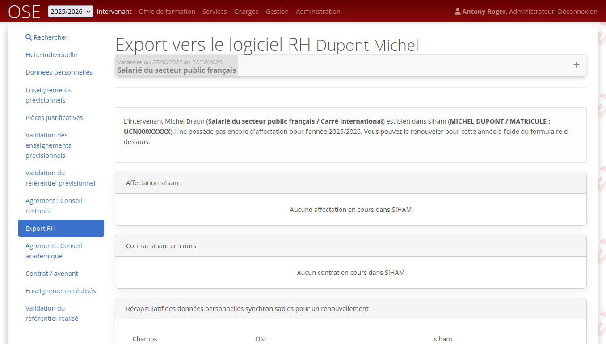
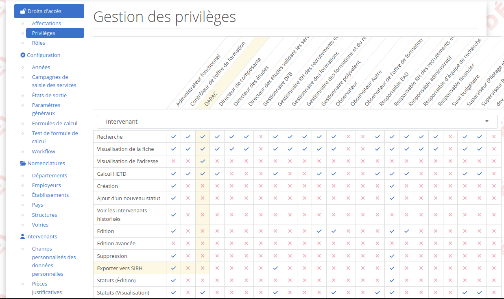
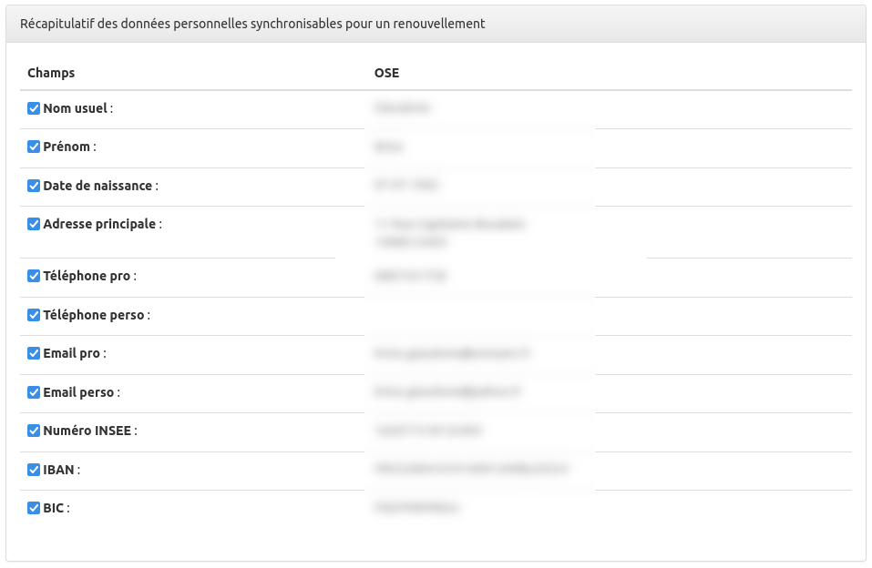
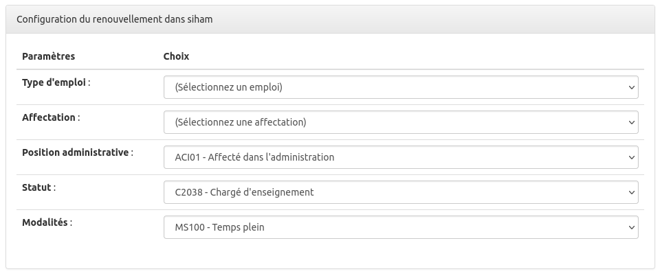
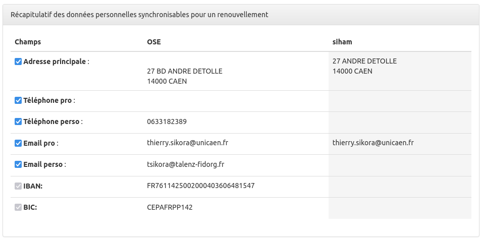
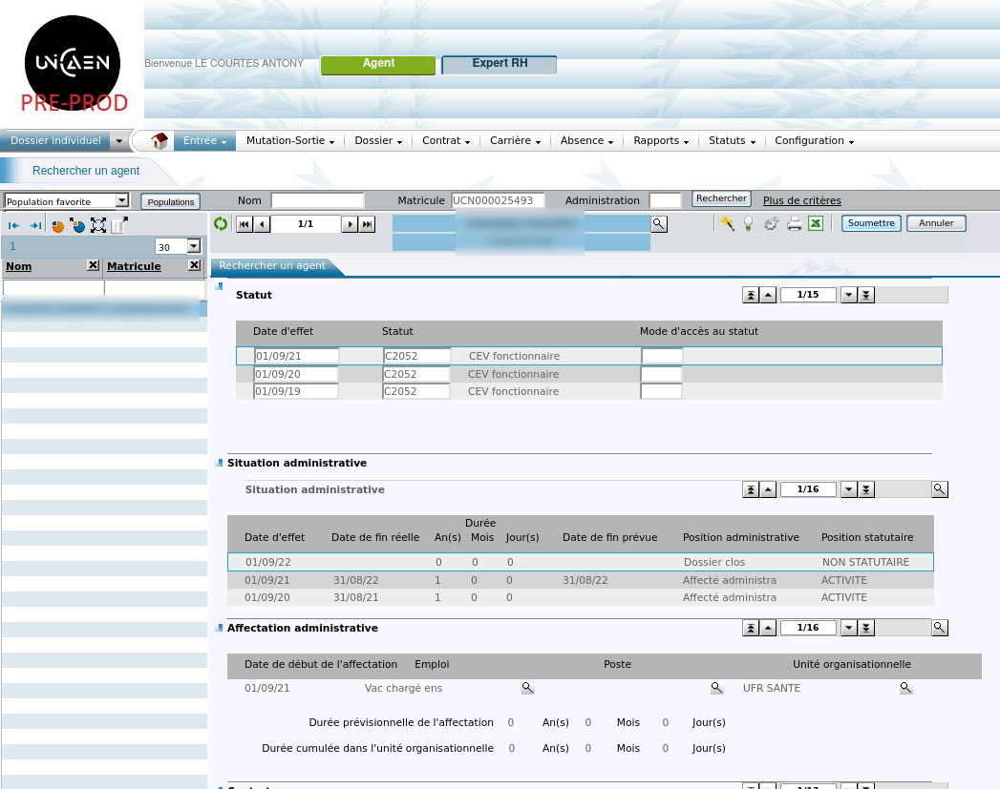
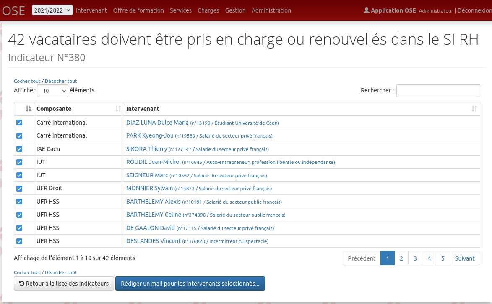

# Principe

Le module ExportRh de OSE permet de rendre une disponible au sein de l'applicatif une fonctionnalité d'export des
données intervenants dans le SI RH. Pour le
moment, seul SIHAM est pris en charge par ce module.

Si vous activez le module export et que vous avez SIHAM, vous pourrez pour un vacataire réaliser une prise en charge ou
un renouvellement directement dans SIHAM à partir de OSE sur l'année universitaire en cours ou précédente.

A l'aide du paramétrage du Workflow, vous pourrez choisir à quel moment de la feuille de route vous considérez que
l'intervenant peut être prise en charge ou renouvellé.

# Fonctionnement du connecteur SIHAM

## Privilège et accès à l'export

Pour accéder aux écrans d'export RH, il faut avoir tout d'abord activer l'export RH au niveau de config.local.php (
voir [configuration de l'export RH](configuration.md)).

Ensuite il faudra paramétrer votre workflow pour choisir quelles dépendances sont nécessaires pour accéder à l'étape de
l'export RH de la feuille de route (ex : contrat retourné signé).

Comme la majorité des fonctionnalités de OSE, il faut également que vous endossiez un role ayant le privilége pour
réaliser l'export.

Export RH :

Voici le nouveau privilège à donner aux rôles :

## Prise en charge d'un intervenant (PEC)

On appelle prise en charge (PEC), le fait d'exporter vers SIHAM un intervenant inconnu du SI RH. Un matricule va être
créé et attribué à cet intervenant.

Pour une PEC, les données personnelles sont injectées dans SIHAM pour la première fois, on parle bien des données issues
du dossier de l'intervenant (données personnelles).

Lors d'une prise en charge, OSE va créer une nouvelle affectation pour l'année universitaire en cours, et créer le
statut, le type d'emploi, la position administrative, le service ainsi que le contrat dans SIHAM, le tout en auto validé
dans SIHAM.

Toutes ces informations sont paramétrables à l'aide du formulaire personnalisé SIHAM :

Si vous avez activé le paramètre 'sync-code', la prise en charge va venir remplacer le code de l'intervenant par le
matricule SIHAM. Ce paramètre est utile
surtout dans le cas où vous créez des comptes locaux à ose pour vos vacataires. (Attention, dans ce cas le connecteur
MV_INTERVENANT.sql qui
alimente OSE avec les intervenants doit bien évidement utiliser le matricule SIHAM comme CODE intervenant afin que la
synchronisationne ne produise pas de
doublon)

Idem pour le paramètre 'sync-source',forcera la source de l'intervenant avec le code source correspondant.

Vous pouvez également peupler la colonne code rh de la table intervenant avec le matricule SIHAM de l'intervenant en
activant le paramétre sync-code-rh.

## Renouvellement d'un intervenant (REN)

On appelle renouvellement (REN), le fait d'exporter vers SIHAM un intervenant déjà connu du SI RH.

Le renouvellement va d'abord mettre à jour certaines données personnelles de l'intervenant, à noter que vous pourrez
désactiver la synchronisation de certaines
données en décochant les lignes :

De la même façon, OSE va créer une nouvelle affectation pour l'année universitaire en cours, et mettre à jour le statut,
le type d'emploi, la position
administrative, le service et créer le contrat dans SIHAM, le tout en auto validé dans SIHAM.

Si vous avez activé le paramètre 'sync-code', le renouvellement va venir remplacer le code de l'intervenant par le
matricule SIHAM. Ce paramètre est utile
surtout dans le cas où vous proposez des comptes locaux ose pour vos vacataires. (Attention, dans ce cas le connecteur
MV_INTERVENANT.sql qui
alimente OSE avec les intervenants doit bien évidement utiliser le matricule SIHAM comme CODE intervenant afin que la
synchronisationne ne produise pas de
doublon)

## Suite à la PEC ou au REN

Une fois la prise en charge ou le renouvellement effectué via OSE, vous retrouverez le dossier de l'agent à jour.

## Synchronisation

Si l'intervenant possède déjà une affectation sur l'année en cours, vous ne pourrez donc pas lancer une PEC ou un REN,
mais vous aurez quand même la possiblité
de synchroniser les quelques données personnelles de OSE vers SIHAM.

## Indicateur

Un nouvel indicateur situé dans la rubrique contrat des indicateurs (indicateur N°380), vous donne la liste des
vacataires à prendre en charge ou à renouveller.

A noter que la table intervenant possède une colonne EXPORT_DATE qui contient la date de la prise en charge ou du
renouvellement.

le module ExporRh.

