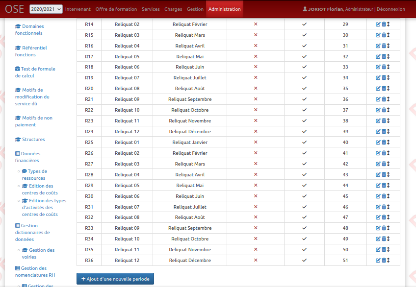

**ATTENTION** : cette documentation est valable à partir de la version 18 de OSE. Pour les anciennes versions les tables sont différentes et le script est à
adapter.

# Avoir d'avantage de période de paiement

## Introduction

Dans l'application OSE, 17 périodes de paiements sont initialement disponibles. 16 d'entre elles permettent d'avoir du mois de septembre de l'année
universitaire choisi au mois de décembre de l'année suivante. La dernière est une période globale pour les paiements tardifs survenue après la 16ème période.

## Modification des périodes

Il est possible à partir de la version 18 d'ajouter, modifier ou supprimer des périodes directement dans OSE depuis l'administration.

Comme il est fastidieux de renseigner beaucoup de période en utilisant le menu d'administration, un [fichier SQL](InsertionPeriodes.sql) permettant d'affiner
les mois de paiements disponibles pour le paiement tardif en transformant la période paiement tardif pour avoir à la place tous les mois sur les quatre années
suivantes a été mis à disposition.

Par exemple si l'on prend l'année 2019/2020, après l'exécution du fichier SQL, on ne verra alors plus le paiement tardif dans la liste mais tous les mois de
septembre 2020 à Décembre 2024.

À vous de reprendre ce fichier SQL et de le modifié dans le cas où vous aimeriez conserver la période de paiement tardif en plus d'ajouter de nouvelles
périodes. 