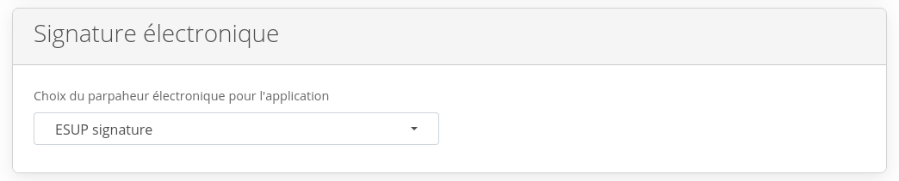
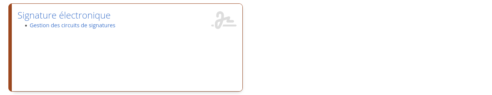
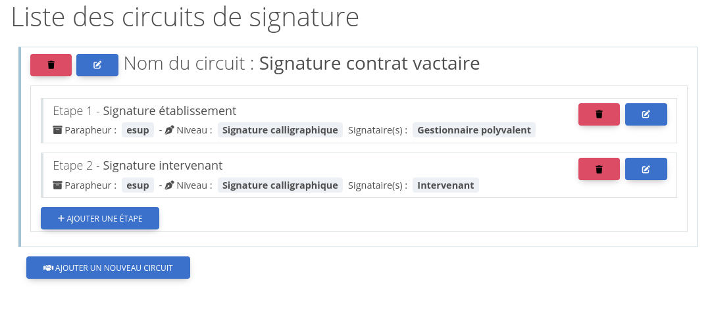
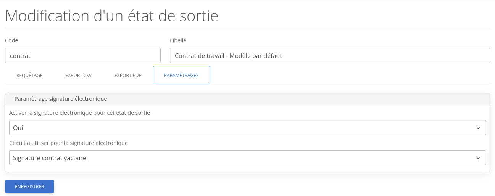
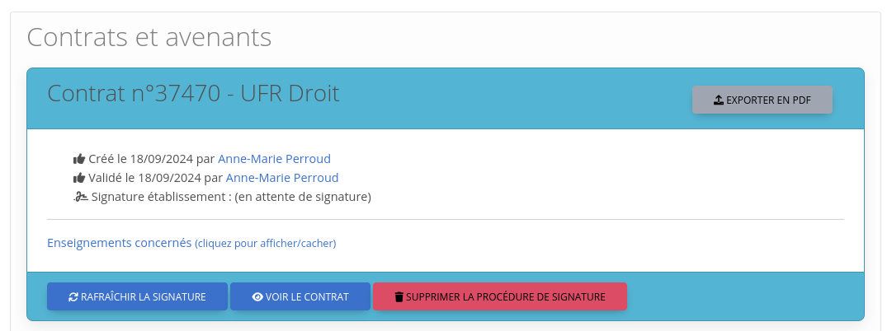

# 📝 Signature Électronique dans OSE (depuis la version 24)

Depuis la **version 24** d'OSE, il est désormais possible d’activer la **signature électronique** pour les **contrats**
et **avenants**, directement au sein de l’application.

> **Actuellement**, seul le parafeur numérique **ESUP SIGNATURE** est disponible. Toutefois, l’objectif est d’étendre
> cette fonctionnalité à d'autres outils de signature électronique adoptés par la communauté OSE.

---

## ⚙️ Configuration de ESUP SIGNATURE

Pour activer **ESUP SIGNATURE**, vous devez ajouter certains paramètres dans le fichier `config.local.php` de votre
application.

Un exemple de ces paramètres est fourni dans le fichier `config.local.php.dist` disponible sur GitLab.

### 🔧 Exemple de configuration

```php
'unicaen-signature' => [

    'log' => true,

    /*
     * Permet de rediriger les destinataires des signatures électroniques.
     * Pratique pour les environnements de pré-production où l’on ne souhaite pas envoyer d’emails réels.
     */
    'hook_recipients' => [
        [
            'firstname' => 'Jean',
            'lastname'  => 'Dupont',
            'email'     => 'jean.dupont@universite.fr',
        ],
    ],

    // Configuration du parafeur numérique (uniquement ESUP pour l'instant)
    'letterfiles' => [
        [
            'label'       => 'ESUP signature',
            'name'        => 'esup',
            'default'     => true,
            'class'       => \\UnicaenSignature\\Strategy\\Letterfile\\Esup\\EsupLetterfileStrategy::class,
            'description' => 'Esup',

            // Niveaux de signature activables dans OSE
            'levels'      => [
                'visa_hidden' => 'hiddenVisa',
                'visa_visual' => 'visa',
                'sign_visual' => 'pdfImageStamp',
                'sign_certif' => 'certSign',
                'sign_eidas'  => 'nexuSign',
            ],

            //A renseigner si vous utilisez la notion de token wildcard dans Esup signature
            'token'       => 'xxxxxxxx-xxxxxxxx-xxxxxxx-xxxxxx',

            'config' => [
                // URL des webservices ESUP
                'url'           => "https://signature.etablissement.fr",
                // Identifiant de l'utilisateur utilisé pour créer les demandes de signature
                'createdByEppn' => 'xxxxxxxxxxx',
            ],
        ],
    ],
],
```

---

## ✅ Activer la Signature Électronique dans OSE

### 1. **Activer la fonctionnalité**

Rendez-vous dans **Paramètres Généraux** de l'application OSE, puis **activez la signature électronique** en
sélectionnant le parafeur souhaité.



---

### 2. **Définir un circuit de signature**

Accédez à :  
**Administration > Signature électronique > Gestion des circuits de signatures**

Vous pouvez y créer et personnaliser des circuits de signature :

  


---

### 3. **Lier un circuit à un état de sortie**

Une fois le circuit créé, vous devez **l'associer à un état de sortie** de contrat. Cela permet de remplacer le flux de
gestion traditionnel d’OSE par le circuit de signature électronique.



---

### 4. **Utilisation en production**

Une fois ces paramétrages en place, **les contrats liés à cet état de sortie bénéficieront automatiquement de la
signature électronique** :



---

## 📌 Résumé

| Étape | Description                                                    |
|-------|----------------------------------------------------------------|
| 1️⃣   | Ajouter les paramètres dans `config.local.php`                 |
| 2️⃣   | Activer la signature électronique dans les paramètres généraux |
| 3️⃣   | Créer un circuit de signature                                  |
| 4️⃣   | Associer ce circuit à un état de sortie de contrat             |


