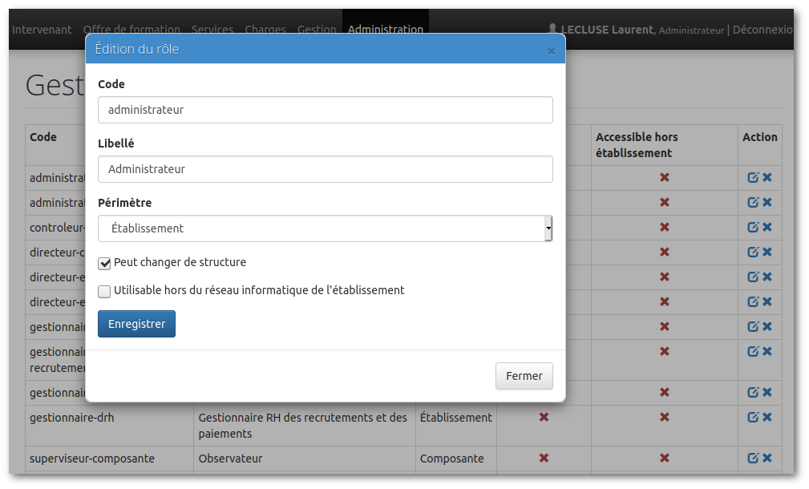

# Detecter si on est connecté depuis l'établissement ou bien depuis l'extérieur

## Introduction

Certaines fonctionnalités de OSE peuvent donner accès à des informations sensibles.
Pour des raisons de sécurité, il est recommandé d'éviter à certains rôles (administrateur, etc.) d'avoir accès à l'application depuis l'extérieur de votre établissement.

## Paramétrage au niveau des rôles


La gestion des rôles se fait dans Administration / Droits d'accès / Rôles.

Dans la fenêtre de création/modification d'un rôle, il vous suffit de cocher ou non "Utilisable hors du réseau informatique de l'établissement".

## Paramétrage de la fonction de détection

Ensuite, pour que le filtrage fonctionne, il faut écrire votre propre règle de détection.
Cela se passe dans votre fichier de configuration `config.local.php`.

Le paramètre global "inEtablissement" est une fonction qu'il vous revient de personnaliser.

Renvoyer :
* `true` signifie qu'on est considéré comme "dans l'établissement";
* `false` signifie qu'on est considéré comme "hors de l'établissement".

A titre d'exemple, à Caen nous réalisons des tests pour savoir :
* si notre IP est locale ou non
* si nous passons par le proxy ou le reverse proxy ou non

Voici un aperçu de notre fonction de filtrage :

```php
        'inEtablissement' => function () {
            $ip        = isset($_SERVER['REMOTE_ADDR']) ? $_SERVER['REMOTE_ADDR'] : '';
            $forwarded =  isset($_SERVER['HTTP_X_FORWARDED_FOR']) ? $_SERVER['HTTP_X_FORWARDED_FOR'] : '';

            $ipInterne = '10.';

            $proxies = [
                // IPs fictives
                '10.1.2.3',
                '10.1.2.4',
                '10.1.2.5',
            ];

            $reverseProxies = [ 
                // IPs fictives
                '193.1.2.3',
                '193.1.2.4,
            ];

            // Si on est en direct et en interne sans passer par le proxy (pas de redirection)
            if (0 === strpos($ip,$ipInterne) && $forwarded === '') return true;

            // Si on est en interne, que l'on sort puis on re-rentre en passant par le reverse proxy
            if (in_array($ip,$reverseProxies) && 0 === strpos($forwarded,$ipInterne)) return true;

            // Si on est en interne, que l'on passe par le proxy en interne
            if (in_array($ip,$proxies) && 0 === strpos($forwarded,$ipInterne)) return true;

            // Sinon, on vient de l'extérieur
            return false;
        },
```

A vous de reprendre et personnaliser cette fonction ou bien d'opter pour une autre stratégie.

A défaut, OSE considère que vous êtes toujours "dans l'établissement", donc le filtrage n'est pas opérant.