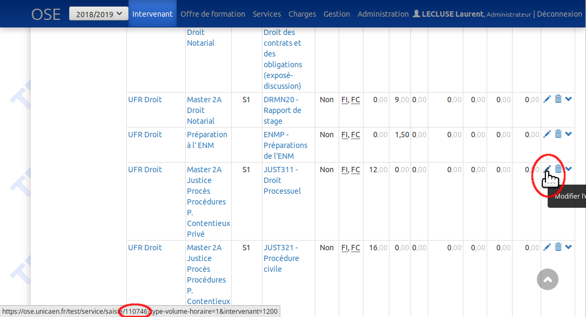

# OSE : Correction d’une fiche de service

## Étape 1 : récupérer l’ID du service concerné
Dans la fiche service de l’intervenant, placer le curseur de la souris sur l’icône « Modifier » représentée par un crayon,
Ensuite, dans l’URL du lien qui s’affiche dans le bas de la fenêtre du navigateur, identifier l’ID (110746 dans l’exemple ci-dessus) et le mémoriser.



## Étape 2 : Aller dans la base de données pour récupérer les volumes horaires concernés
Exécuter la requête suivante pour récupérer toutes les informations nécessaires à la suite de la procédure :

```sql
SELECT
  /* Libellés pour retrouver la bonne ligne */
  tvh.libelle       type_vh,
  ep.code           element,
  str.libelle_court structure,
  p.libelle_court   semestre,
  ti.code           type_intervention,
  mnp.libelle_court motif_non_paiement,
  src.code          source,
  vh.horaire_debut  horaire_debut,
  vh.horaire_fin    horaire_fin,
  /* Identifiants */
  s.id              service_id,
  vh.id             volume_horaire_id,
  vvh.validation_id validation_id,
  vh.contrat_id     contrat_id,
  /* Heures */
  vh.heures
FROM
  volume_horaire vh
  JOIN service s ON s.id = vh.service_id AND s.histo_destruction IS NULL
  JOIN type_volume_horaire tvh on tvh.id = vh.TYPE_VOLUME_HORAIRE_ID
  JOIN periode p on p.id = vh.periode_id
  JOIN type_intervention ti on ti.id = vh.type_intervention_id
  JOIN source src ON src.id = vh.source_id
  LEFT JOIN motif_non_paiement mnp ON mnp.id = vh.motif_non_paiement_id
  LEFT JOIN element_pedagogique ep ON ep.id = s.element_pedagogique_id
  LEFT JOIN structure str ON str.id = ep.structure_id
  LEFT JOIN VALIDATION_VOL_HORAIRE vvh on VVH.VOLUME_HORAIRE_ID = vh.id
  LEFT JOIN validation v ON v.id = VVH.VALIDATION_ID AND v.histo_destruction IS NULL
WHERE
  vh.histo_destruction IS NULL
  AND s.id = /* ID DU SERVICE */
;
```

## Étape 3 : intervention en base de données
### Procédure

Une fois que vous avez identifié le ou les volumes horaires à traiter, plusieurs cas de figure se présentent :
* Si le volume horaire a un contrat, alors il est impossible de le modifier, il faut donc supprimer d’abord le contrat correspondant dans OSE avant de pouvoir le modifier.
* Si le volume horaire a une validation, alors il faut
  * Soit supprimer la validation dans OSE (mais cela va impacter aussi d’autres volumes horaires)
  * Soit retirer un volume horaire spécifique d’une validation (procédure ci-dessous).

Ensuite, procéder aux opérations suivantes :
* Historiser le volume horaire (procédure ci-dessous)
* Recalculer la feuille de route de l’intervenant : la fiche de service ayant changé, il convient de recalculer la feuille de route de l’intervenant, car cela peut avoir de l’influence sur l’état d’avancement du Workflow.

### Requêtes :

Retirer un volume horaire d’une validation (s’il ne fait pas l’objet d’un contrat) :
```sql
DELETE FROM VALIDATION_VOL_HORAIRE WHERE volume_horaire_id = /*VOLUME_HORAIRE ID*/
```

Historiser un volume horaire :
```sql
UPDATE volume_horaire SET histo_destruction=SYSDATE, histo_destructeur_id=/*UTILISATEUR_ID*/;
```

L’UTILISATEUR_ID doit être le vôtre. Il correspond à une valeur de la colonne UTILISATEUR.ID